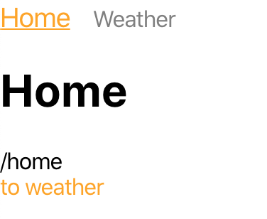
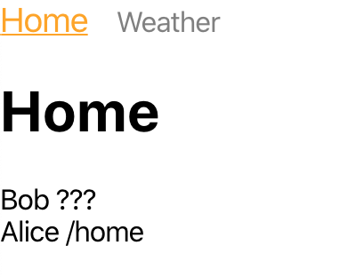

# React Router

Managing multiple views in a React app.

## Covers

1. Why we want to use it
2. Setup
3. Conditional rendering based on a path
4. Navigating Pages
5. Accessing Router information within Component
6. Params

## Why we want to use it

When our application grows, it is common to have too many contents to make sense within a page.

One possible solution is to separate the contents into different workflows or different Views.

Having a Router within the application allows users to reach out to the different views while staying within our application. React Router is a handy JS library that allows us to achieve this functionality quickly.

Say our application has:

- /home
- /photo-gallery
- /weather

When a user appends `/weather` to the path in their browser, React Router will only render the components specified within the `/weather` route.

## Setup

The package we are going to use is react-router-dom.

```sh
npm install react-router-dom
```

https://reacttraining.com/react-router/web/guides/quick-start

```javascript
import React from "react";
import { BrowserRouter } from "react-router-dom"; // 1. import BrowserRouter

function App() {
  return (
    <BrowserRouter>
      {/* Wrap the contents of App with Browser Router*/}
      <div>Hello World!</div>
    </BrowserRouter>
  );
}

export default App;
```

## Conditional rendering

### Rendering JSX directly

`Route` component helps to decide if a component should render.

First, we can import the Route component.

```javascript
import { BrowserRouter, Route } from "react-router-dom";
```

Then we can add 2 Routes, `/home` and `weather`. For now, we are just going to render the title of the page.

```javascript
<BrowserRouter
  getUserConfirmation={(message, callback) => {
    const allowTransition = window.confirm(message);
    callback(allowTransition);
  }}
>
  <div>Hello World!</div>
  <Route path="/home" render={() => <h1>Home</h1>} />
  <Route path="/weather" render={() => <h1>Weather</h1>} />
</BrowserRouter>
```

Try hitting URL `<path to react app>/home` (i.e. http://localhost:3000/home)
You should be able to see the "Home" printed below the hello world.

Now try to hit the URL to weather.
You can see "Weather" is printed instead of "Home".

The behaviour of the route is straightforward.

1. Look at our current URL
2. Checks if the path of URL **begins with** the path provided
3. render if matches, else do nothing

The checking logic can seem a little weird at the beginning.
Say `<Route path="/home" render={() => <h1>Home</h1>} />`

- http://`<host>`/home is a match
- http://`<host>`/hom is **NOT** a match
- http://`<host>`/homealone is **NOT** a match
- http://`<host>`/home-alone is **NOT** a match
- http://`<host>`/home/dinosaur is a match

if we do not want `home/dinosaur` to be a match, we can add `exact` property
`<Route path="/home" exact render={() => <h1>Home</h1>} />`

### Rendering Components with Route

1. Move Home and Weather into a `containers` folder.
2. Import Home and Weather in App.js
3. Replace `render` with `component` and pass in the Component

src/containers/Home.js

```javascript
import React from "react";

export default () => <h1>Home</h1>;
```

src/containers/Weather.js

```javascript
import React from "react";

export default () => <h1>Weather</h1>;
```

src/App.js

```javascript
// ...
import Home from "./containers/Home";
import Weather from "./containers/Weather"

// ...
<Route path="/home" component={Home} />
<Route path="/weather" component={Weather} />
// ...
```

Everything should work the same as before.

### Rendering only one component with Switch

When path matches, the `Route` component will then render the state component.

```javascript
<Route path="/home/admin" render={() => <div>Admin</div>} />
<Route path="/home" render={() => <div>User</div>} />
```

When we hit the path `<host>/home/admin`, both "Admin" and "User" is printed out.
To fix this, we can add the Switch.

Sometimes we only want to render the first matching component.
React Router allow us to do so with the `<Switch>` Component.

```javascript
import { BrowserRouter, Route, Switch } from "react-router-dom";
```

```javascript
<Switch>
  <Route path="/home/admin" render={() => <div>Admin</div>} />
  <Route path="/home" render={() => <div>User</div>} />
</Switch>
```

Hit `<host>/home/admin` again, now only "Admin" is printed out.

### Showing a default page

Using `Switch`, we can prepare a "Page not found" Component and render out when no path matches.

```javascript
< Switch>
  <Route path="/home/admin" render={() => <div>Admin</div>} />
  <Route path="/home" render={() => <div>User</div>} />
  <Route path="/" render={() => <div>Page Not Found</div>}>
</Switch>
```

Ending the Switch with a Route with path `/` ensures the page is always reachable.

If we want to redirect to a specific page, we can use a `Redirect`

```javascript
//...
import { BrowserRouter, Route, Switch, Redirect } from "react-router-dom";

//...
<Switch>
  <Route path="/home/admin" render={() => <div>Admin</div>} />
  <Route path="/home" render={() => <div>User</div>} />
  <Route path="/404" render={() => <div>page Not Found</div>} />
  <Redirect to="/404" />
</Switch>;
```

## Navigating Page

We have learnt to set up Routes to do the conditional rendering.

### Anchor tags

Using anchor tags or `window.location.href` will cause the browser to reload the entire React app, breaking the Single Page Application experience.

Let's try it out:

```javascript
<BrowserRouter>
  <div>
    <a href="/home">Home</a>
  </div>
  <div>
    <a href="/" onClick={() => (window.location.href = "/weather")}>
      Weather
    </a>
  </div>
  <Switch>
    <Route exact path="/home" component={Home} />
    <Route exact path="/weather" component={Weather} />
    <Route path="/404" render={() => <div>page Not Found</div>} />
    <Redirect to="/404" />
  </Switch>
</BrowserRouter>
```

### Link

Instead, we should be using `Link` components:

```javascript
// ...
import { BrowserRouter, Route, Switch, Redirect, Link } from "react-router-dom";

//...
<BrowserRouter>
  <div>
    <Link to="/home">Home</Link>
  </div>
  <div>
    <Link to="/weather">Weather</Link>
  </div>
  <Switch>
    <Route exact path="/home" component={Home} />
    <Route exact path="/weather" component={Weather} />
    <Route path="/404" render={() => <div>Page Not Found</div>} />
    <Redirect to="/404" />
  </Switch>
</BrowserRouter>;
```

This way, the React app no longer refreshes on load.

### Using Navlink to style active links

Say we want to tell the user where they are by showing the active links in a different colour.
We can do that using `NavLink` instead of `Link`

`NavLink` works the same as `Link` but adds an "active" class name that allows us to style the active link differently.

src/App.css

```css
header > a + a {
  margin-left: 1em;
}

a {
  color: gray;
  text-decoration: none;
}

a.active {
  color: orange;
  font-size: larger;
  text-decoration: underline;
}
```

src/App.js

```javascript
// ...
import { BrowserRouter, Route, Switch, NavLink } from "react-router-dom";

//...
<BrowserRouter>
  <header>
    <NavLink to="/home">Home</NavLink>
    <NavLink to="/weather">Weather</NavLink>
  </header>

  <Switch>
    <Route exact path="/home" component={Home} />
    <Route exact path="/weather" component={Weather} />
  </Switch>
</BrowserRouter>;
```

The `a.active` in `App.css` styles the active component. The style is added correctly because of the add `active` class.

Is also possible to change the added class name with `activeClassName` or add inline styling `activeStyle`. In most cases, you do not need to customise the class name or inline styling.


## Accessing Router information

React Router provides you with 3 objects.

1. history: allows you to navigate, e.g. `goBack` to the previous page
2. location: gets the current path in the React app
3. match: contains information about the `Route` and access to the query parameters.

You can refer to the [official document](https://reactrouter.com/web/guides/quick-start) for the usage; for now we will focus on how to access them.

Components rendered from `Route` contains these 3 objects injected into the properties.

src/containers/Home.js

```javascript
import React from "react";

export default (props) => {
  return (
    <div>
      <h1>Home</h1>
      <div>{props.location.pathname}</div>
      <div
        style={{
          color: "orange",
          cursor: "pointer",
        }}
        onClick={() => props.history.push("/weather")}
      >
        to weather
      </div>
    </div>
  );
};
```

1. We gain access to location object, which consists of the pathname
2. Clicking on the "to weather" link brings us to `/weather`.

Note: we do not recommend inline styling in general.



### Accessing router objects from child component

We can access `history`, `location` and `match` in the Child component by

1. passing from parent
2. using the `withRouter` higher-order component

The second way is preferred to decouple Router related information from the components.
In the example below, we try to print out the current pathname if we have access to the location object; if not we print "???".

In our Home component, we render the Component and the same Component wrapped with `withRouter`.
The same Component wrapped within the `withRouter` gains access to the location object and print out the current path as expected.

src/containers/Home.js

```javascript
import React from "react";
import { withRouter } from "react-router-dom";

const UserName = (props) => {
  return (
    <div>
      {props.name} {props.location ? props.location.pathname : "???"}
    </div>
  );
};

const UserNameWRouter = withRouter(UserName);

export default (props) => {
  return (
    <div>
      <h1>Home</h1>
      <UserName name="Bob" />
      <UserNameWRouter name="Alice" />
    </div>
  );
};
```



## Params

### Query params

Query params can be used to filter items from a list.

src/containers/Food.js

`/food?type=fruit`

```javascript
import React from "react";
import { withRouter } from "react-router-dom";

const menu = [
  { name: "chicken rice", type: "meal" },
  { name: "laksa", type: "meal" },
  { name: "durian", type: "fruit" },
];

const Food = (props) => {
  const useQuery = new URLSearchParams(props.location.search);
  const type = useQuery.get("type");
  const filteredFoods = menu.filter((food) => food.type === type);

  return (
    <div>
      <span>you have selected: </span>
      {filteredFoods.map((food) => (
        <b>{food.name}</b>
      ))}
    </div>
  );
};

export default withRouter(Food);
```

### Path params

Path params can be used to select specific information to render.

For example: if we have a menu of items, and each food item maps to a specific id, we can fetch an item based on the query params.

`/food/1`

```javascript
import React from "react";
import { withRouter } from "react-router-dom";

const menu = {
  1: "chicken rice",
  2: "laksa",
  3: "durian",
};

const Food = (props) => {
  const foodId = props.match.params.id;
  const foodName = menu[foodId] || "something not in the menu";
  return (
    <div>
      <span>you have selected: </span>
      <b>{foodName}</b>
    </div>
  );
};

export default withRouter(Food);
```

src/App.js

```javascript
<Route path="/food/:id" component={Food} />
```

Try accessing `/food/2` - the Component will display "you have selected: laksa".

## Exercise

1. https://github.com/thoughtworks-jumpstart/react-router-lab
