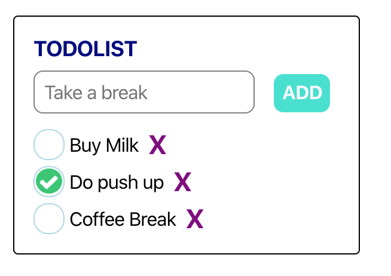
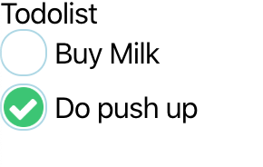
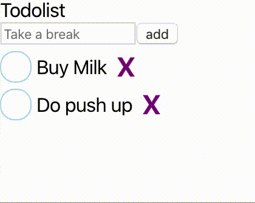

# Building a todo list



## Creating the todo list skeleton

1. Create a new folder called "components"
2. Create a new file "Todolist.js", within the new folder
3. Create a placeholder for the Todolist

```javascript
import React from "react";

class Todolist extends React.Component {
  render() {
    return (
      <div>
        <div>Todolist</div>
      </div>
    );
  }
}

export default Todolist;
```

Our todo list holds some data about the items in the todo list.
We are likely to use `state` to keep track of the items inside of the list so we can use a class component to help us.

4. Import Todolist in App.js

```javascript
import React from "react";
import "./App.css";
import Todolist from "./components/Todolist";

function App() {
  return (
    <div>
      <Todolist />
    </div>
  );
}

export default App;
```

We should now see the word "Todolist" displayed at the top left of the browser.

## Displaying Todo items

1. In `this.state`, add an array `todos`
2. Initialise it with some dummy value for now. A todo should be an object with a `name` and `isDone` property.

```javascript
class Todolist extends React.Component {
  constructor(props) {
    super(props);
    this.state = {
      todos: [
        { name: "Buy Milk", isDone: false },
        { name: "Do push up", isDone: true },
      ],
    };
  }

  displayTodos() {
    return this.state.todos.map((todo) => (
      <div>
        <span>{todo.name}</span>
        <span>{todo.isDone ? " - completed" : " - not completed"}</span>
      </div>
    ));
  }

  render() {
    return (
      <div>
        <div>Todolist</div>
        <div>{this.displayTodos()}</div>
      </div>
    );
  }
}

export default Todolist;
```

## Creating a TodoItem Component

1. Create a TodoItem component to host todo logic
2. Find a good looking green tick image and put it inside the public folder

```javascript
import React from "react";

export default ({ name, isDone }) => (
  <div>
    <span>
      {isDone && (
        
      )}
    </span>
    <span>{name}</span>
  </div>
);
```

2. Display todos using the TodoItem component in Todolist

```javascript
  displayTodos() {
    return this.state.todos.map(todo => (
      <div>
        <TodoItem name={todo.name} isDone={todo.isDone} />
      </div>
    ));
```


Let's try to style the component a little.

In TodoItem.css

```css
.todo-item {
  display: flex;
  align-items: center;
}

.todo-item__completed {
  height: 1.5em;
  width: 1.5em;
  border: 1px solid lightblue;
  border-radius: 0.75em;
  display: flex;
  justify-content: center;
  align-items: center;
}

.todo-item__completed img {
  height: 20px;
}

.todo-item__name {
  margin-left: 5px;
}
```

In Todo.js

```javascript
import React from "react";
import "./TodoItem.css";

export default ({ name, isDone }) => (
  <div className="todo-item">
    <span className="todo-item__completed">
      {isDone && }
    </span>
    <span className="todo-item__name">{name}</span>
  </div>
);
```



## Complete or Uncomplete a todo item

To achieve this, we can identify an individual item.
We can do this by assigning a Universally Unique Identifier(UUID) to the individual item.

```sh
npm install uuid
```

In Todolist

```javascript
import React from "react";
import Todo from "./Todo";
import { v4 as uuidv4 } from "uuid"; // 1. import the UUID

class Todolist extends React.Component {
  constructor(props) {
    super(props);
    this.state = {
      todos: [
        {
          id: uuidv4(), // 2. add uuid to the item
          name: "Buy Milk",
          isDone: false,
        },
        {
          id: uuidv4(), // 3.add uuid to the item
          name: "Do push up",
          isDone: true,
        },
      ],
    };
  }

  displayTodos() {
    return this.state.todos.map((todo) => {
      // 4. add a method that can change the status of isDone
      const setTodo = (isDone) => {
        const currentTodo = this.state.todos.filter(
          (todoToFilter) => todoToFilter.id === todo.id
        )[0];
        currentTodo.isDone = isDone;
        this.setState({ todos: [...this.state.todos] });
      };
      // 5. pass in the method as a prop to Todo component
      return (
        <TodoItem name={todo.name} isDone={todo.isDone} setTodo={setTodo} />
      );
    });
  }

  render() {
    return (
      <div>
        <div>Todolist</div>
        <div>{this.displayTodos()}</div>
      </div>
    );
  }
}

export default Todolist;
```

In our TodoItem

```javascript
import React from "react";
import "./Todo.css";

// destructure the new property "setTodo"
export default ({ name, isDone, setTodo }) => (
  <div className="todo-item">
    {/*on clicking the circle, toggle the status of the todo item*/}
    <span className="todo-item__completed" onClick={() => setTodo(!isDone)}>
      {isDone && }
    </span>
    <span className="todo-item__name">{name}</span>
  </div>
);
```


## Deleting an item

1. First, we can add a method to delete the Todo
2. Add it as a Prop in the todo item

```javascript
  displayTodos() {
    return this.state.todos.map(todo => {
      const setTodo = isDone => {
        const currentTodo = this.state.todos.filter(
          todoToFilter => todoToFilter.id === todo.id,
        )[0];
        currentTodo.isDone = isDone;
        this.setState({ todos: [...this.state.todos] });
      };

      // add a delete function
      const deleteTodo = () => {
        const todosWithoutItem = this.state.todos.filter(
          todoToFilter => todoToFilter.id !== todo.id,
        );
        this.setState({ todos: [...todosWithoutItem] });
      };

      return (
        <TodoItem
          name={todo.name}
          isDone={todo.isDone}
          setTodo={setTodo}
          deleteTodo={deleteTodo} // add it as a prop
        />
      );
    });
```

3. Add an X, on clicking on the X. We can delete the item. We can also use an image like how we did for the tick.

```javascript
export default ({ name, isDone, setTodo, deleteTodo }) => (
  <div className="todo-item">
    <span className="todo-item__completed" onClick={() => setTodo(!isDone)}>
      {isDone && }
    </span>
    <span className="todo-item__name">{name}</span>

    <span onClick={() => deleteTodo()} className="todo-item__delete">
      X
    </span>
  </div>
);
```

4. Style to make it look nice

```css
.todo-item__delete {
  color: red;
  font-weight: bold;
  font-size: 1.4rem;
  margin-left: 8px;
}

.todo-item__delete:hover {
  font-size: 1.6rem;
  cursor: pointer;
}
```

Now we have a todo list that items we can delete.

## Adding new todo items

1. Add an input box in Todolist

```javascript
<input
  type="text"
  value={this.state.newItemName}
  onChange={this.handleChange}
  placeholder="Take a break"
/>
```

2. Add a handle change function

```javascript
handleChange = (event) => {
  this.setState({ newItemName: event.target.value });
};
```

Notice that the `handleChange` function is an arrow function. Arrow function bind the current context allowing `this` in `this.setState` pointing to the Todolist.

3. Add a button below the input box and create a new function addNewTodo

```javascript
<button onClick={() => this.addNewTodo()}>add</button>
```

```javascript
  addNewTodo() {
    const { newItemName: name } = this.state;
    if (!name || !name.length) {
      return;
    }

    this.setState({
      newItemName: "",
      todos: [
        ...this.state.todos,
        {
          id: uuidv1(),
          name: name,
          isDone: false,
        },
      ],
    });
  }
```

In `addNewTodo`, we check that name is not empty; if the name is empty, we can ignore the request to add the item.

When adding a new item, we clear the state of `newItemName` as the user is unlikely to add 2 items of the same name.



In the console, we currently see the warning:
`index.js:1 Warning: Each child in a list should have a unique "key" prop.`

Having an array of elements without a `key` property creates a warning shown above. Having a key also helps React to improve performance when content within the array changes.

The fix is to add a unique id as key in the array of Todo items.

```javascript
  displayTodos() {
    return this.state.todos.map(todo => {
      const setTodo = this.createSetTodo(todo);
      const deleteTodo = () => this.createDeleteTodo(todo);

      return (
        <TodoItem
          key={todo.id}
          name={todo.name}
          isDone={todo.isDone}
          setTodo={setTodo}
          deleteTodo={deleteTodo}
        />
      );
    });
  }
```

Currently, the `displayTodos` function is long. We can try to shorten the logic by moving the creating of the `setTodo` and `deleteTodo` to a separate function

```javascript
createSetTodo(todo) {
    return isDone => {
      const currentTodo = this.state.todos.filter(
        todoToFilter => todoToFilter.id === todo.id,
      )[0];
      currentTodo.isDone = isDone;
      this.setState({ todos: [...this.state.todos] });
    };
  }

createDeleteTodo(todo) {
  return () => {
    const todosWithoutItem = this.state.todos.filter(
      todoToFilter => todoToFilter.id !== todo.id,
    );
    this.setState({ todos: [...todosWithoutItem] });
  };
}

displayTodos() {
  return this.state.todos.map(todo => {
    const setTodo = this.createSetTodo(todo);
    const deleteTodo = this.createDeleteTodo(todo);

    return (
      <TodoItem
        key={todo.id}
        name={todo.name}
        isDone={todo.isDone}
        setTodo={setTodo}
        deleteTodo={deleteTodo}
      />
    );
  });
}
```

## Exercise

1. Improve the UI of your Todolist.
2. Add a prop that takes in the title of the todo list and display it as the title.
3. Add an input box and a button to create a new todo list.
