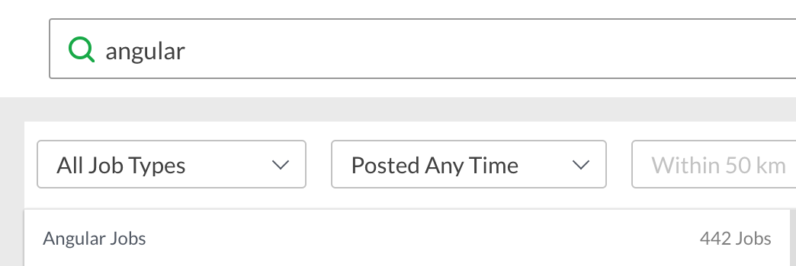
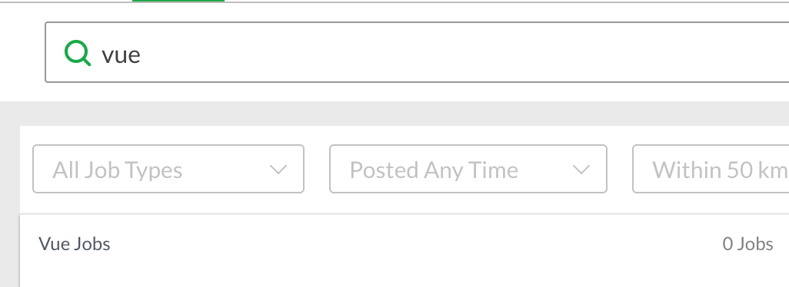

# Why React

A brief comparison of React vs other available options

## Covers

1. What is React
2. How is React different from Bootstrap or Material UI
3. Why do we want to use a framework
4. Why React over Angular.js or Vue.js

## What is React

React is a JavaScript library build by Facebook to create UI components/user interface.

You are not required to use React or other JS libraries to create UI components but having a library helps you to structure your code in a way that components can easily be reused. Your code will also be easier to maintain.

## How is React different from Bootstrap or Material UI

Bootstrap and Material UI are libraries for UI components. Though it might sound the same, the difference is significant. A _UI component library_ provides you with plug-and-play components that are immediately ready for use. They are pre-built and already styled and have interaction functionality. A JS library, like React, is usually used to create new components and group them.

A JS library used to create UI components like React is often used together with UI component libraries to speed up development time. This means we can use Bootstrap or Material UI along with React.

For web applications that require a highly customised design, it might be better not to use any UI component library. Adding styles to components from a UI Component library requires some amount of time and effort. When updating the libraries, new styles added might cause bugs or undesired behaviour, developers would have to spend time checking the components carefully.

If there is enough flexibility in a project to utilise a UI component library, it may be best to use one. You can get the best of both worlds of being able to use a very well-developed UI component library and use a JS library such as React to group components together to form Views.

## Why do we want to use a JS framework

Having a JS framework for creating components gives structure to your code and encourage reusability of components. The timing to triggering a re-render can be a challenging task without a library helping you to keep track of whether your data has changed.

- Give structure
- Encourage reusability
- Group closely related View and functionality together.
- Better developer tools such as React Developer Tool
  - check the inner state of components
  - profiling for performance
- Possibly faster rendering by grouping changes together in virtual DOM and update the DOM together

## Why React over Angular or Vue

### Is react better than Angular or Vue

- Short answer NO

### Job opportunity in Singapore As of 27 Dec 2019

- Glassdoor

  - react: 653
  - angular + angularjs(v1): 442
  - vue: 0

  
  
  

- LinkedIn Jobs

  - react: 1083
  - angular + angularjs(v1): 852
  - vue: 204

  
  
  

### Flexibility

- React motto, "learn once, write everywhere."

  - Desktop apps with React and Electron
  - Mobile apps through React Native

- Popularity

  - Download trends: https://www.npmtrends.com/angular-vs-react-vs-vue

  

### Learning Curve

Angular's learning curve tends to be very steep, requires you to know both JavaScript and TypeScript well and some harder software engineering concepts such as Dependency Injection (DI). Once learned, you can easily build fast and powerful web apps quickly. ‌

React does not provide a complete solution and is often used with other libraries. React is often used with JSX, which uses a HTML-like syntax. Often, you will need to have excellent JavaScript skills to filter data and extract the data what you want in React. React can also be hard to setup. Luckily, a tool such as _create-react-app_ can handle the problematic setup for you. ‌

Vue is very lightweight and relatively easy to learn. At the time of writing, Vue is transiting to v3. It is not as mature as Angular and React and is not backed by big companies such as Google and Facebook. It also allows you to structure your code in a flexible way. However, this might lead to inadequate designs and bugs that are hard to discover if you are not careful.

### Conclusion

Having a JS library like React helps with structuring code properly and encourage reusability. React is by far the most popular library and requires a complement of solid javascript skills. You can build native apps with React too.
